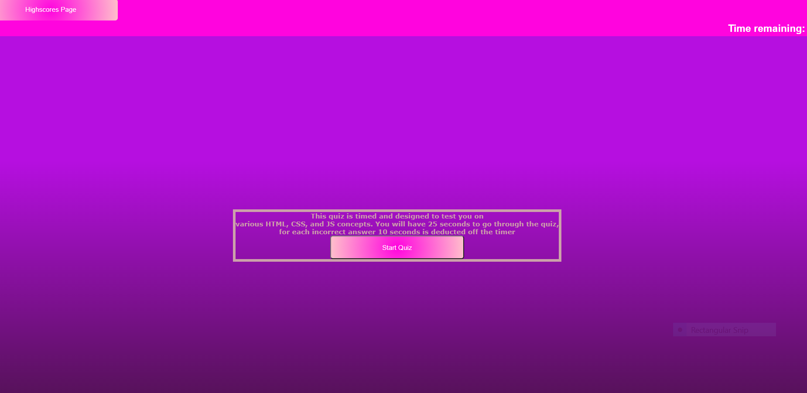
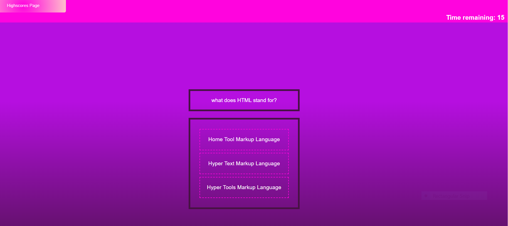
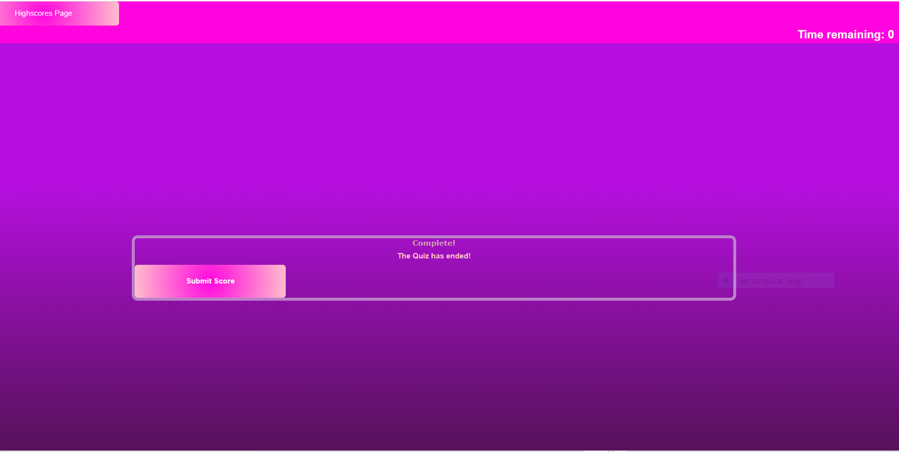
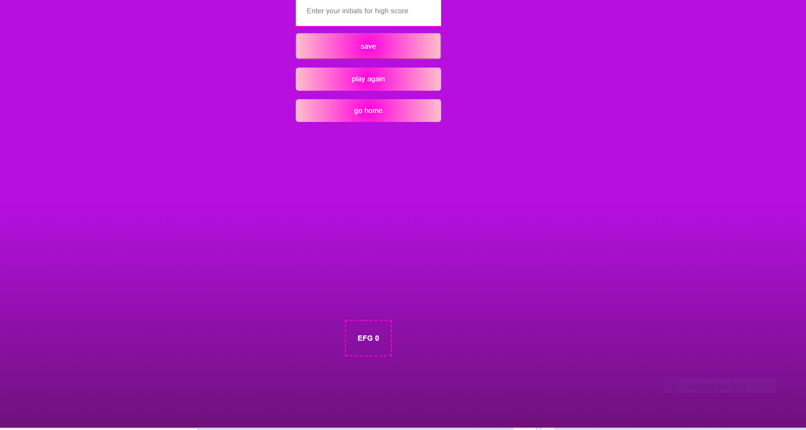
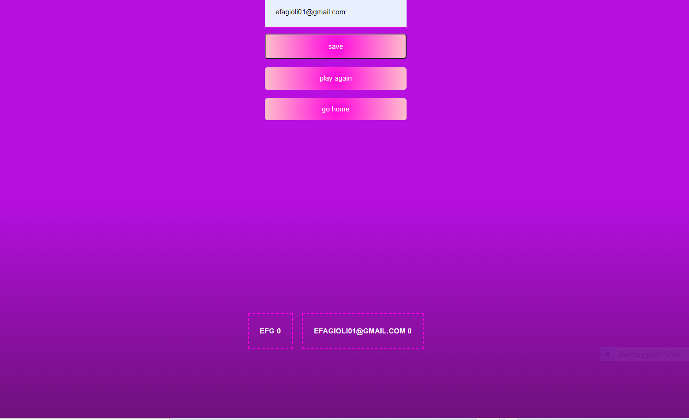

# API-code-quiz

## Assignemnt

For the fourth homework assignment in week four of UNH Full-Stack Coding Bootcamp I was to build a multiple choice  quiz that is time coded.

## The User Story

```
AS A coding boot camp student
I WANT to take a timed quiz on JavaScript fundamentals that stores high scores
SO THAT I can gauge my progress compared to my peers

```

## Description

This application generates a quiz that is multiple choice and is timed. The timer is set to start at 25 seconds and for each incorrect response 10 seconds is deducted from the time. The score is based on the time left on the timer at the end of the quiz. For example if when the user is finished with the quiz 15 seconds is still left on the clock, their final score will equal 15. On the start page of the quiz there is a small description letting the user know what they will be quized on, how much time they have to complete it, and how their score is calculated. The timer is set up in the top right corner and when the user is ready there is a start quiz button which starts the timer and generates the questions. Also on the start page there is a button that links to a highscores page for the user to see past scores. Once the user completes the quiz they receive a message that the quiz has ended and are presented with a submit score button. Once the user submits their score, they are taken to the highscores page. On the highscores page the user is presented with a form to enter their initials for highscore. Once they enter their initials they are then able to click save, and their scores are presented on the page as well as saved to local storage. On this page there are two other buttons, one to return home to the start page and one to play the quiz again, when clicked this button will redirect the user back to start the quiz.  

## Built with

* HTML
* CSS
* JavaScript

## Links

* [GitHub Repository](https://github.com/efagioli01/API-code-quiz)
* [Deployed Application](https://efagioli01.github.io/API-code-quiz/)


## Screenshot 
 
 
 
 
 
 
